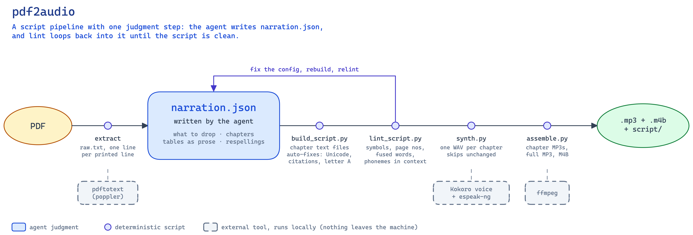

# pdf2audio

[](https://github.com/qiyanjun/pdf2audio-agent-skill/actions/workflows/tests.yml)

A Claude Code plugin (one agent skill) that turns a PDF into audio worth listening to. The agent rewrites the extracted
text into a narration script: citations removed, tables and figures described in prose,
acronyms respelled. A neural voice running locally then reads it, and the result is packaged as
MP3 and as a chaptered M4B audiobook. Nothing leaves the machine.

## Install

In a terminal:

```bash
claude plugin marketplace add qiyanjun/pdf2audio-agent-skill
claude plugin install pdf2audio@pdf2audio-agent-skill
```

Or inside Claude Code:

```
/plugin marketplace add qiyanjun/pdf2audio-agent-skill
/plugin install pdf2audio@pdf2audio-agent-skill
```

Both steps are needed: the first registers this repository as a plugin marketplace, the second
installs the plugin from it. Check the result with `claude plugin list`.

### Prerequisites

The plugin calls three command-line tools you install once: Python 3.10 or newer, `pdftotext`
(from poppler), and `ffmpeg`.

| Platform | Command |
|---|---|
| macOS (Homebrew) | `brew install poppler ffmpeg` |
| Debian / Ubuntu | `sudo apt install poppler-utils ffmpeg python3-venv wamerican` |
| Fedora | `sudo dnf install poppler-utils ffmpeg python3 words` |

On Linux, the word list (`wamerican` or `words`) is optional: the linter uses it to spot words
fused by a lost hyphen, and skips that one check without it. macOS includes one.

This plugin has been used on macOS with Apple silicon. Linux should work the same way. Windows
is untested; if you try it, use WSL and follow the Debian/Ubuntu line.

### Use it

Start a new Claude Code session, so the skill list is reloaded, and ask in plain words:

> convert ~/Downloads/paper.pdf into audio I can listen to

The first time, Claude runs the one-time voice setup itself: it downloads the Kokoro voice
model (about 350 MB) into `~/.cache/pdf2audio`. The audio lands next to the PDF in a
`<name>-audio/` folder. You can also call the skill directly as `/pdf2audio:pdf2audio`.

### Update and uninstall

```bash
claude plugin marketplace update pdf2audio-agent-skill    # fetch the latest version
claude plugin update pdf2audio@pdf2audio-agent-skill

claude plugin uninstall pdf2audio@pdf2audio-agent-skill   # remove the plugin
rm -rf ~/.cache/pdf2audio                                 # and the voice
```

The voice lives outside the plugin folder, so updates do not download it again. `update` only
acts when the version in `.claude-plugin/plugin.json` changes; if you are testing unreleased
edits, uninstall and reinstall instead.

### Without the plugin system

The skill itself is the folder `skills/pdf2audio/`. Any agent that reads `SKILL.md` skills can
use it from a skills directory:

```bash
git clone https://github.com/qiyanjun/pdf2audio-agent-skill.git
ln -s "$PWD/pdf2audio-agent-skill/skills/pdf2audio" ~/.claude/skills/pdf2audio   # all projects
# or, for one project: cp -R pdf2audio-agent-skill/skills/pdf2audio .claude/skills/
```

The linked clone is also the easiest setup for editing the skill: changes take effect in the
next session. To download the voice ahead of time rather than on first use, run
`bash skills/pdf2audio/scripts/setup_tts.sh` from the clone. `PDF2AUDIO_HOME` sets another
location for the voice; keep that path short (see Troubleshooting in `SKILL.md`). The script
ends with a voice check; a line like `Voice check: ɹˈɛdi tə nɚɹˈeɪt` means it works.

## How it works

A PDF read aloud as-is is unlistenable: page numbers land mid-sentence, table cells come out in
scrambled order, citation numbers are read aloud, and acronyms are pronounced as words. So most
of the work is turning the extracted text into a script written for the ear. Only one step
needs judgment; the rest are scripts.



```
PDF → pdftotext → raw.txt → [narration.json] → build_script.py → script/*.txt
    → lint_script.py (fix, rebuild) → synth.py → wav/*.wav → assemble.py → .mp3 + .m4b
```

1. **Extract.** `pdftotext` dumps the text, one line per printed line.
2. **Write `narration.json`** (the judgment step, done by the agent). It reads the whole raw
   text, and the page images where a table's layout is ambiguous, and records its decisions:
   - which line ranges to drop: page numbers, figure and table bodies with their captions, the
     reference list;
   - where chapters, sections and paragraphs start, so the listener hears the structure;
   - *inserts*: prose that replaces each figure and table, with content tables walked through
     row by row in full sentences;
   - *substitutions* for the ear: acronyms, respelled names, dates, symbols, lost hyphens.

   The body text itself is never summarized or reworded.
3. **Build and lint.** `build_script.py` applies the config and writes one text file per
   chapter. It also applies a few fixes that are always right: Unicode normalization,
   citation removal, and respelling the letter "A" in acronyms so it isn't read as "uh".
   `lint_script.py` reports what the voice would stumble on: leftover symbols, leaked page
   numbers, fused words, and, for every acronym and respelling, the exact phonemes the voice
   will produce in that sentence. Because the agent cannot hear audio, these phonemes are how it
   checks pronunciation. It fixes the config and rebuilds until the script is clean.
4. **Narrate.** `synth.py` reads each chapter through the voice in sentence-sized pieces and
   adds pauses after paragraphs and headings. A chapter whose audio is newer than its text is
   skipped, so fixing one chapter re-narrates only that chapter.
5. **Package.** `assemble.py` writes per-chapter MP3s, one full MP3, and an `.m4b` with chapter
   marks. It also copies the script next to the audio, so the listener can check what was read.

**Several PDFs:** step 2 is independent per document, so the agent can hand each document to a
parallel sub-agent. Narration then runs as one sequential job, because each narration already
uses every CPU core.

## The voice: Kokoro

[Kokoro-82M](https://huggingface.co/hexgrad/Kokoro-82M) is a small, open-weight text-to-speech
model:

- **Origin and size:** released around the turn of 2025 by hexgrad, with 82 million parameters.
- **Quality:** it ranked near the top of the public TTS Arena leaderboard at release, despite
  being far smaller than cloud voices.
- **License:** Apache 2.0, free to use, including commercially.
- **Architecture:** based on StyleTTS 2; it produces 24 kHz audio.

This skill runs it through [`kokoro-onnx`](https://github.com/thewh1teagle/kokoro-onnx), a port
that uses ONNX Runtime on the CPU, so no GPU or PyTorch is needed. The model
(`kokoro-v1.0.onnx`, 325 MB) and the voice pack (`voices-v1.0.bin`) live in
`~/.cache/pdf2audio`. On Apple silicon it runs about 10x faster than real time: an hour of audio
in about six minutes.

**Voices** are named by accent and gender: `af_heart` (default, **A**merican **f**emale),
`af_bella`, `am_michael`, `am_adam` (American male), and `bf_emma`, `bm_george` (British; use
`--lang en-gb`).

**Why pronunciation needs care.** Kokoro does not read letters directly. First a rule-based
tool, [espeak-ng](https://github.com/espeak-ng/espeak-ng), converts the text into phonemes, and
Kokoro then voices those phonemes. Most mispronunciations come from that first step, not from
the voice model:

- a lone "A" becomes "uh";
- "LLMs" loses its plural;
- "UVA" is said differently before a comma.

For the same reason, `lint_script.py` can show pronunciations as phonemes without anyone
listening: it asks espeak-ng for exactly what Kokoro will be told to say.

**Trade-offs versus cloud voices** (OpenAI, ElevenLabs):

- Kokoro is free, private and fast, and no text leaves the machine, which matters for
  unpublished drafts.
- It is somewhat flatter over a long listen and has no emotional range to direct.
- It cannot clone a voice.
- Its English is much stronger than its other languages.

## Layout

| Path | Purpose |
|---|---|
| `.claude-plugin/plugin.json` | Plugin manifest: name, version, description. |
| `.claude-plugin/marketplace.json` | Lets this repository be added as a one-plugin marketplace. |
| `skills/pdf2audio/SKILL.md` | The workflow the agent follows. |
| `skills/pdf2audio/references/narration-guide.md` | Config fields and the rules for rewriting text for the ear. |
| `skills/pdf2audio/assets/narration.example.json` | Starting point for a document's config. |
| `skills/pdf2audio/scripts/setup_tts.sh` | Installs the Kokoro voice and checks dependencies. |
| `skills/pdf2audio/scripts/tts_common.py` | Locates and loads the installed voice (shared by the scripts that speak). |
| `skills/pdf2audio/scripts/build_script.py` | `raw.txt` + `narration.json` -> one text file per chapter. |
| `skills/pdf2audio/scripts/lint_script.py` | Flags symbols, leaked page numbers and fused words; shows phonemes in context. |
| `skills/pdf2audio/scripts/synth.py` | Script -> one WAV per chapter (incremental). |
| `skills/pdf2audio/scripts/assemble.py` | WAVs -> chapter MP3s, full MP3, chaptered M4B. |
| `docs/pdf2audio-schematic.png` | The pipeline diagram above; `.excalidraw` beside it is the editable source. |

## Tests

```bash
python3 -m unittest discover -s tests -v
```

The tests cover the deterministic scripts: how the builder turns raw text and a config into
chapters, what the linter flags, and how the packager writes the MP3 and chaptered M4B. They
also check that the plugin manifests agree. Several of them pin down mispronunciations and
breakages found while narrating real documents, such as look-alike semicolons and a lone "A"
read as "uh". They need only Python and `ffmpeg`. GitHub Actions runs them on every push.

A smoke test that narrates one sentence with the real voice runs only where the voice is
installed. Use the voice's interpreter to include it:
`~/.cache/pdf2audio/venv/bin/python -m unittest discover -s tests`.

## Manual use

From a clone, without an agent:

```bash
K=skills/pdf2audio/scripts
V=~/.cache/pdf2audio/venv/bin/python
bash $K/setup_tts.sh
pdftotext paper.pdf work/raw.txt
# write work/narration.json (see skills/pdf2audio/assets/ and references/)
python3 $K/build_script.py work/raw.txt work/narration.json work/script
$V $K/lint_script.py work/script --words "Nersk, Sigh-Dack"   # --words: test respellings
$V $K/synth.py work/script work/wav --voice af_heart
python3 $K/assemble.py work/wav work/script paper-audio --title "Paper title"
```

## Author

Yanjun Qi. Released under the [MIT License](LICENSE).
